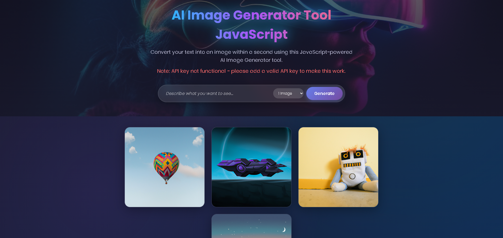

# 🤖 AI Image Generator

A modern, stylish web application that generates images from text descriptions using artificial intelligence.



## ✨ Description

AI Image Generator is a JavaScript-powered tool that allows users to create stunning images by simply typing a text description. The application uses the Replicate API with Stable Diffusion model to generate high-quality images based on user prompts.

## 🎯 Features

- **🎨 Text-to-Image Generation**: Convert any text description into AI-generated images
- **📸 Multiple Image Options**: Generate 1-4 images at once
- **⬇️ Download Capability**: Easily download generated images
- **💎 Modern UI**: Beautiful, responsive design with glassmorphism effects
- **📅 Dynamic Year**: Copyright year automatically updates

## 🛠️ Technologies Used

- **HTML5**: Semantic markup
- **CSS3**: Modern styling with gradients, animations, and responsive design
- **JavaScript**: API integration and DOM manipulation
- **Replicate API**: Image generation using Stable Diffusion

## 🚀 Setup

1. Clone this repository
2. Open `index.html` in your browser
3. Add your Replicate API key in `script.js` (replace the API_KEY value)

## 🔑 API Key Setup

To make the image generation work:

1. Get an API key from [Replicate](https://replicate.com/)
2. Open `script.js`
3. Replace the `API_KEY` value with your key:
   ```javascript
   const API_KEY = "your-api-key-here";
   ```

## 📖 Usage

1. Enter a description of the image you want to create (e.g., "a cat in space" 🐱🚀)
2. Select how many images you want to generate (1-4)
3. Click the "Generate" button
4. Wait for the AI to create your images ⏳
5. Hover over any image to see the download button

## 📁 File Structure

```
AI Image Generator/
├── index.html          # Main HTML file 📄
├── style.css          # Styling and animations 🎨
├── script.js          # JavaScript logic and API integration ⚙️
├── images/
│   ├── bg.jpg         # Background image 🖼️
│   ├── img-1.jpg      # Sample image
│   ├── img-2.jpg      # Sample image
│   ├── img-3.jpg      # Sample image
│   ├── img-4.jpg      # Sample image
│   ├── loader.svg     # Loading animation ⏲️
│   └── download.svg   # Download icon ⬇️
└── README.md          # This file 📝
```

## 📜 License

MIT License - Feel free to use this project for learning and development.

## 👏 Credits

- Powered by [Replicate](https://replicate.com/) and Stable Diffusion
- Created with JavaScript ☕
